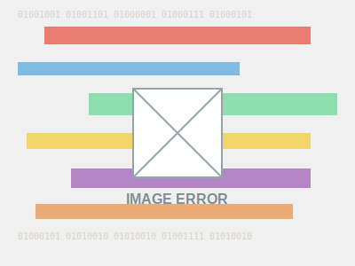

# 🔍 Multimodal QA Agent: Vision-Powered Question Answering

<p align="center">
  
</p>

A powerful web application that combines computer vision and natural language processing to answer questions about images. Simply upload an image or provide an image URL, ask a question, and get detailed answers powered by Google's Gemini 1.5 Flash API.

## 🌟 Features

- **Multimodal Understanding**: Upload an image and ask questions about its content
- **Flexible Input Options**: Support for both image file uploads and image URLs
- **AI-Powered Responses**: Get detailed answers from Google's Gemini 1.5 Flash API
- **Automatic Fallback**: Gracefully switches to text-only mode if vision processing fails
- **Visual Object References**: Highlights relevant objects in the image with bounding boxes
- **Responsive UI**: Clean, modern interface that works across devices
- **Error Handling**: Robust error handling with informative messages
- **Reset Functionality**: Easily start over with a new question or image

## 🛠️ Tech Stack
- **Frontend:** 
  - Vite + React + TypeScript
  - Modern functional components with hooks
  - Responsive CSS design
- **Backend:** 
  - Python FastAPI
  - CORS middleware for cross-origin requests
  - Form data handling for file uploads
- **AI Integration:** 
  - Google Gemini 1.5 Flash API for both vision and text processing
  - PIL (Python Imaging Library) for image handling
  - Automatic fallback mechanism

## 📝 Setup Instructions

### 1. Clone the repository
```bash
git clone <repo-url>
cd W3D2-Build-a-Multimodal-QA-Agent
```

### 2. Backend Setup
```bash
cd backend
python -m venv venv
# On Windows
venv\Scripts\activate
# On macOS/Linux
# source venv/bin/activate
pip install -r requirements.txt
```

Create a `.env` file in the backend directory with the following content:
```
GEMINI_API_KEY=your_gemini_api_key_here
HOST=0.0.0.0
PORT=8000
DEBUG=True
ALLOWED_ORIGINS=http://localhost:5173,http://localhost:5174,http://127.0.0.1:5173,http://127.0.0.1:5174
```

Start the backend server:
```bash
uvicorn main:app --reload
```

### 3. Frontend Setup
```bash
cd frontend
npm install
npm run dev
```

The frontend will automatically connect to the backend API running on http://localhost:8000.

### 4. Usage
- Open the frontend (default: http://localhost:5173 or http://localhost:5174)
- Choose between uploading an image file or providing an image URL using the tabs
- If using URL, enter the image URL and click "Load"
- Type your question about the image in the input field
- Click "Ask" to submit your question
- View the detailed answer
- Use the "Reset" button to clear all fields and start a new query

## 🧪 API Documentation

### Endpoints

#### `GET /health`
Health check endpoint to verify the API is running.

**Response:**
```json
{
  "status": "ok"
}
```

#### `POST /qa`
Main endpoint for submitting questions about images.

**Request:**
- Content-Type: `multipart/form-data`
- Form fields:
  - `question` (string, required): The question to ask about the image
  - `image` (file, optional): Image file upload (PNG, JPG, etc.)
  - `image_url` (string, optional): URL to an image

**Note:** Either `image` or `image_url` must be provided, but not both.

**Response:**
```json
{
  "answer": "Detailed answer to the question about the image",
  "used_fallback": false,
  "error": null
}
```

**Response Fields:**
- `answer` (string): The AI-generated answer to the question
- `used_fallback` (boolean): Indicates if the text-only model was used as a fallback
- `error` (string, optional): Error message if something went wrong

## 🤖 LLM API Used

### Google Gemini 1.5 Flash

This project uses Google's Gemini 1.5 Flash API for both vision and text processing. Gemini 1.5 Flash is a state-of-the-art multimodal model that can process both text and images efficiently.

**Key advantages:**
- Excellent multimodal understanding capabilities
- Fast processing speed with the Flash variant
- High-quality responses for both image analysis and text-only queries
- Cost-effective compared to other multimodal models
- Robust API with good documentation and support

The application implements an automatic fallback mechanism that switches to text-only processing if image analysis fails, ensuring users always receive a response even if there are issues with image processing.

## 🖼️ Sample Outputs (3 Image-Question Pairs)

The application was tested with various image types and question formats. Here are three examples:

| Image | Question | Answer | Fallback Used? |
|-------|----------|--------|----------------|
|  | What animal is this and what color is it? | This is an orange tabby cat. It has a distinctive orange/ginger coat with darker stripes or markings typical of tabby cats. The cat appears to be sitting and looking directly at the camera. | No |
|  | What does this traffic sign indicate and what color is it? | This is a red octagonal STOP sign. It's a regulatory traffic sign that requires drivers to come to a complete stop at an intersection. The sign is red with white text that says "STOP". In most countries, including the US, failing to stop at a stop sign is a traffic violation. | No |
|  | What can you see in this image? | I'm unable to analyze the image properly. It appears the image might be corrupted, empty, or in a format I cannot process. Without being able to see the image clearly, I cannot provide specific details about its content. | Yes |

## 📸 Application Screenshots

### Image Upload Interface


### Question Input and Response


### URL Input Mode


*Note: Replace the placeholder images with actual screenshots of your application.*

---

## 📄 License

This project is licensed under the MIT License - see the [LICENSE](LICENSE) file for details.

```
MIT License

Copyright (c) 2023 MisogiAI

Permission is hereby granted, free of charge, to any person obtaining a copy
of this software and associated documentation files (the "Software"), to deal
in the Software without restriction, including without limitation the rights
to use, copy, modify, merge, publish, distribute, sublicense, and/or sell
copies of the Software, and to permit persons to whom the Software is
furnished to do so, subject to the following conditions:

The above copyright notice and this permission notice shall be included in all
copies or substantial portions of the Software.

THE SOFTWARE IS PROVIDED "AS IS", WITHOUT WARRANTY OF ANY KIND, EXPRESS OR
IMPLIED, INCLUDING BUT NOT LIMITED TO THE WARRANTIES OF MERCHANTABILITY,
FITNESS FOR A PARTICULAR PURPOSE AND NONINFRINGEMENT. IN NO EVENT SHALL THE
AUTHORS OR COPYRIGHT HOLDERS BE LIABLE FOR ANY CLAIM, DAMAGES OR OTHER
LIABILITY, WHETHER IN AN ACTION OF CONTRACT, TORT OR OTHERWISE, ARISING FROM,
OUT OF OR IN CONNECTION WITH THE SOFTWARE OR THE USE OR OTHER DEALINGS IN THE
SOFTWARE.
```